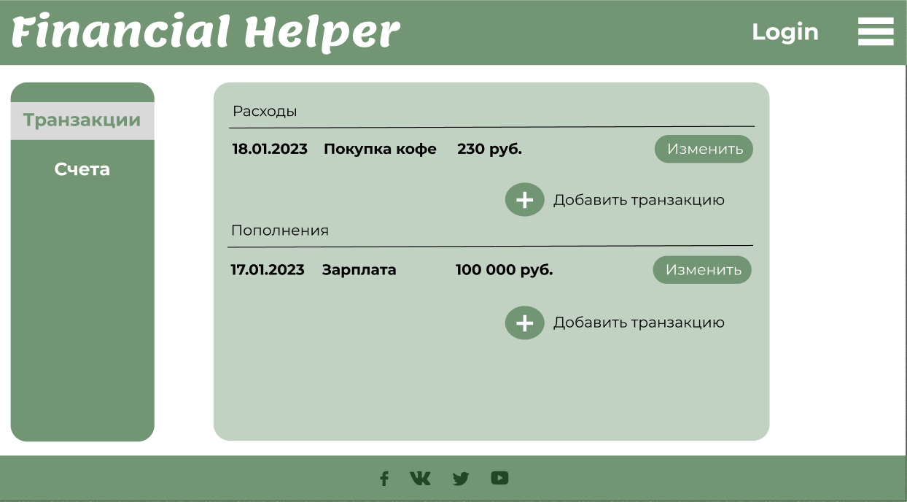

# otus-kotlin-backend

Учебный проект курса
[Kotlin Backend Developer](https://otus.ru/lessons/kotlin/?int_source=courses_catalog&int_term=programming).
Поток курса 2023-04.

**Финансовый учет** - это веб-приложение, которое предназначено для учета финансовых транзакций, управления счетами и
категориями расходов, а также анализа финансовых данных. Приложение позволяет пользователям авторизоваться, добавлять,
редактировать и удалять пользователей, транзакции, счета и категории, а также получать аналитику по расходам.

## MVP

MVP (Minimum Viable Product) нашего приложения включает следующие основные функциональности:

- Авторизация пользователей с разграничением доступа по ролям.
- Создание, чтение, обновление и удаление пользователей.
- Создание, чтение, обновление и удаление транзакций.
- Создание, чтение, обновление и удаление счетов.
- Создание, чтение, обновление и удаление категорий расходов.
- План/факт - возможность задания и отслеживания планируемых расходов и фактических затрат.
- Уведомления о платежах - оповещение пользователей о предстоящих или просроченных платежах.
- Методы для получения аналитики - функционал для анализа финансовых данных и предоставления отчетов.
- Интеграция с Telegram-ботом - возможность получения уведомлений и управления приложением через Telegram.
- Рассылка отчетов по тратам - автоматическая отправка отчетов о расходах пользователям по электронной почте.
- RnD Tinkoff API - исследование и интеграция API Tinkoff для получения информации о финансовых операциях.

## Визуальная схема фронтенда

## Сущности приложения

Приложение включает следующие основные сущности:

- Пользователь: содержит информацию о зарегистрированных пользователях, их ролях и доступе к функциональностям приложения.
- Транзакция: представляет собой финансовую операцию, включающую сумму, дату, категорию расходов и связанный счет.
- Счет: представляет банковский счет или другой финансовый инструмент, на котором хранятся денежные средства пользователя.
- Категория: отражает тип расходов, например, питание, транспорт, развлечения и т.д.

- Пользователь: информация о пользователе (имя, электронная почта, пароль);
- Транзакция: сумма, дата, описание, категория, тип (расход или доход);
- Счет: название, валюта, текущий баланс;
- Категория: название, тип (расход или доход);
- Уведомление: тип (например, предупреждение о превышении бюджета), связанная транзакция или счет.

## Документация

1. Маркетинг
    1. [Заинтересанты](./docs/02-stakeholders.md)
    2. [Целевая аудитория](./docs/01-target-audience.md)
    3. [Конкурентный анализ](./docs/03-concurrency.md)

2. DevOps

[//]: # (    1. [Схема инфраструктуры]&#40;./docs/02-devops/01-infrastruture.md&#41;)

[//]: # (    2. [Схема мониторинга]&#40;./docs/02-devops/02-monitoring.md&#41;)

3. Тесты

4. Архитектура

    1. [Компонентная схема](imgs/financy-app-architect.png)
    
[//]: # (    2. [Интеграционная схема]&#40;./docs/04-architecture/02-integration.md&#41;)

[//]: # (    3. [Описание API]&#40;./docs/04-architecture/03-api.md&#41;)

# Структура проекта

[//]: # (## Подпроекты для занятий по языку Kotlin)

[//]: # ()
[//]: # (1. [m1l1-hello]&#40;m1l1-hello&#41; - Вводное занятие, создание первой программы на Kotlin)

[//]: # (2. [m1l2-basic]&#40;m1l2-basic&#41; - Основные конструкции Kotlin)

[//]: # (3. [m1l3-oop]&#40;m1l3-oop&#41; - Объектно-ориентированное программирование)

[//]: # (4. [m1l4-dsl]&#40;m1l4-dsl&#41; - Предметно ориентированные языки &#40;DSL&#41;)
